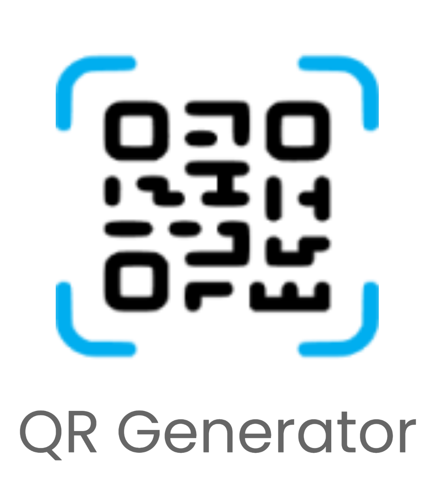
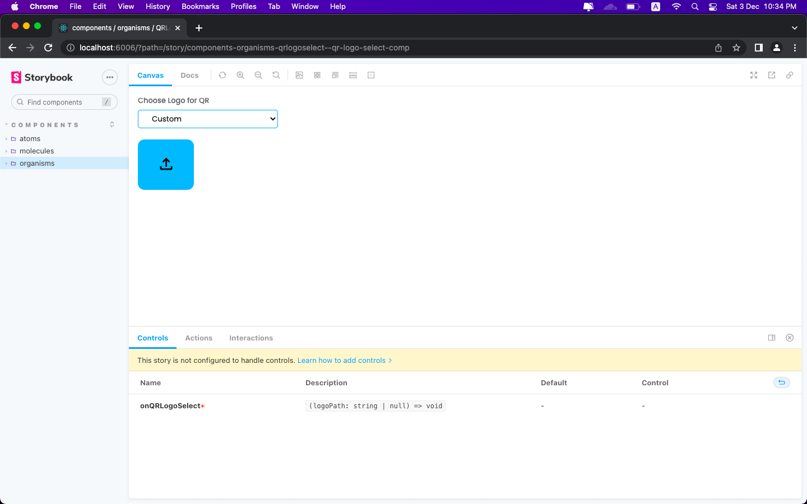

<div align="center">
    
</div>
<br/>

## About

QR generator app allows you to create bulk of QRs from Csv file.

## Tech Stack

- Electron JS
- Python
- React JS
- Typescript
- Scss

## Python

The main function of the app is written in python like Csv processing and generating qr.

### Setup

Activate the python virtual env.

```
$ pipenv shell
```

Install packages

```
$ pipenv install
```

There are two commands.

One is to get the information of the columns. Which columns have unique values so it can be used to name the generated QRs image and which columns contain URL.

```
$ python main.py get-columns [CSV File Path]
```

Second is to generate the QRs.

```
$ python main.py generate-qr [CSV File Path] [Column for the images name] [Logo to use in middle in QR code] [Output folder]
```

To connect python with javascript Electron app, convert the python script into exec and exe file using **pyinstaller**.

```
$ pyinstaller -F main.py
```

This command will generate exec file if you are using MAC and exe file if you are using Windows.
The outputed file can be spawned as subprocess using node js **child_process** package.

## Electron App

The desktop app is developed using **_Electron JS_** and UI is written in **_React JS + SCSS_**.
Used Storybook to document the components.

### Setup

Install packages

```
$ npm install
```

Start development

- For Mac
  ```
  $ npm run dev-mac
  ```
- For Windows
  ```
  $ cd src/electronProcess/
  $ tsc index.ts && tsc preload.ts
  $ npm run dev-win
  ```

Build Production app

```
$ npm run electron-pack
```

Open Storybook

```
$ npm run story book
```


